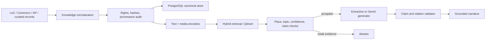

# Kathakaar

Provenance-first multimodal cultural retrieval and grounded storytelling.

[](https://github.com/Siddhantdamre/Kathakaar/actions/workflows/ci.yml)
[](LICENSE)

Kathakaar turns a place, topic, or cultural image into a narrative whose
factual claims remain linked to retrieved evidence. Version 3 adds normalized
knowledge ingestion, rights and attribution auditing, typed image/audio/video
assets, hybrid text-media retrieval, optional pretrained SigLIP embeddings,
guarded generative AI, PostgreSQL persistence, and Qdrant vector export.

The maintained system is deliberately hybrid. Deterministic provenance and
abstention rules surround pretrained neural components; no model is allowed to
invent evidence or silently substitute a source from the wrong place.

## Recruiter Quick Look

| Evidence | What it demonstrates |
| --- | --- |
| `src/kathakaar/knowledge.py` | LoC, Wikimedia Commons, IIIF, rights, hashes, and validation. |
| `src/kathakaar/consistency.py` | Auditable claim support gate with explicit unsupported terms. |
| `src/kathakaar/multimodal.py` | Hybrid text/media retrieval and optional SigLIP inference. |
| `src/kathakaar/rag.py` | Guarded extractive or GenAI generation with claim validation. |
| `src/kathakaar/storage.py` | Optional PostgreSQL and Qdrant production adapters. |
| `knowledge/kathakaar_v3.jsonl` | Normalized, versioned cultural knowledge records. |
| `benchmarks/multimodal_v3/` | Media-aware retrieval and abstention regression suite. |
| `tests/` | Deterministic unit and end-to-end regression coverage. |
| `.github/workflows/ci.yml` | Lint, typing, tests, ingestion, fitting, and v1-v3 evaluation. |

## Architecture



## Multimodal Benchmark v3

The checked-in v3 knowledge base contains 28 normalized records and 13
rights-aware media assets from Wikimedia Commons and the Library of Congress,
alongside the curated UNESCO source summaries.
Every record has a content hash, publisher, retrieval date, rights status,
review status, and typed media metadata.

| Metric | Score |
| --- | ---: |
| Positive-query coverage | 1.000 |
| Accuracy when accepted | 1.000 |
| Top hit with media evidence | 0.500 |
| Place consistency | 1.000 |
| Conflict/OOD rejection | 1.000 |
| False acceptance | 0.000 |

The default benchmark uses deterministic caption/transcript embeddings so CI
does not require a GPU. `kathakaar[multimodal]` activates actual pretrained
SigLIP image-text embeddings over the same records and interfaces.

## Grounding Benchmark v1

Grounding Benchmark v1 contains 12 paraphrased cultural source notes and 12
held-out queries covering Hampi, Kyoto, Timbuktu, Machu Picchu, Agra, and
Mahabalipuram.

| Retriever | Recall@1 | Recall@3 | MRR | Citation precision |
| --- | ---: | ---: | ---: | ---: |
| BM25 | 1.000 | 1.000 | 1.000 | 1.000 |
| TF-IDF | 1.000 | 1.000 | 1.000 | 1.000 |

The perfect score reflects a deliberately small and separable regression
benchmark. It demonstrates reproducibility and correct source attribution, not
broad cultural knowledge or real-world factuality. See
`docs/evaluation/grounding_v1.md`.

## Quick Start

```bash
python -m pip install -e ".[dev]"
python scripts/build_knowledge_v3.py
python -m kathakaar kb-audit
python -m kathakaar fit-multimodal
python -m kathakaar validate-multimodal
```

Generate a guarded multimodal story:

```bash
python -m kathakaar rag-story \
  "stone chariot and ceremonial Vittala temple architecture" \
  --place "Hampi, India" \
  --theme "craft and devotion"
```

Use a local generative model after retrieval:

```bash
python -m kathakaar rag-story \
  "stone chariot and ceremonial Vittala temple architecture" \
  --place "Hampi, India" \
  --theme "craft and devotion" \
  --generator ollama \
  --ollama-model llama3.2
```

Use real image embeddings:

```bash
python -m pip install -e ".[multimodal]"
python -m kathakaar fit-multimodal \
  --encoder siglip \
  --output artifacts/multimodal_siglip_v3.json
```

Add authoritative collection records:

```bash
python -m kathakaar ingest-loc "Agra India" --format photos
python -m kathakaar ingest-commons "Hampi stone chariot" --place "Hampi, India"
python -m kathakaar ingest-iiif https://example.org/iiif/manifest
```

Production synchronization:

```bash
python -m pip install -e ".[production]"
python -m kathakaar sync-postgres
python -m kathakaar sync-qdrant
```

Run verification:

```bash
make verify
```

Equivalent commands:

```bash
python -m ruff check src scripts tests
python -m mypy src
python -m pytest -q
```

Regenerate the checked evaluation artifacts with `make evaluate`.

## Output Contract

Every generated result contains:

- a title and readable narrative
- structured claims
- one or more source IDs for each factual claim
- source titles, URLs, places, and text
- matched media IDs and separate text/media retrieval scores
- rights, attribution, source version, and content-hash metadata
- no uncited factual claim in the structured claim list

GenAI output is parsed as structured claims. A result is rejected if it cites
an unretrieved source or does not overlap sufficiently with its evidence.

## Repository Structure

```text
src/kathakaar/
  cli.py
  consistency.py
  evaluation.py
  generation.py
  knowledge.py
  multimodal.py
  rag.py
  retrieval.py
  schemas.py
  storage.py
knowledge/kathakaar_v3.jsonl
benchmarks/multimodal_v3/
tests/
docs/evaluation/
Project_Walkthrough.ipynb
finalprojectsubmission.ipynb
```

The notebooks are retained as historical prototype artifacts. The maintained
implementation lives under `src/kathakaar/`.

## Neural Training Decision

Kathakaar does not train a foundation model from scratch. It uses pretrained
retrievers and generators, then measures them behind a stable evidence
contract. Fine-tuning starts only after collecting at least 5,000
community-reviewed query-positive-negative examples with explicit rights and
place metadata. See `docs/TRAINING_STRATEGY.md`.

## Limitations

- The v3 corpus is still small and primarily English.
- The checked-in neural-free benchmark evaluates metadata-level media
  retrieval; SigLIP must be evaluated on a GPU before claiming visual accuracy.
- Token support is a conservative transparent check, not full semantic
  entailment.
- Live source ingestion can change and must be snapshot-tested.
- Cultural interpretation and sensitive living heritage require community
  review, consent, and the ability to remove or restrict records.

## License

MIT
