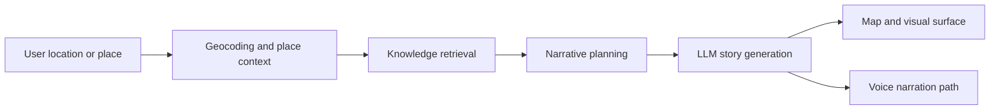

# Kathakaar - Cultural AI Storytelling Studio

[](https://siddhantdamre.github.io/Kathakaar/)
[](https://github.com/Siddhantdamre/Siddhantdamre/blob/main/PORTFOLIO.md)
[](LICENSE)

Kathakaar is an agentic cultural storytelling prototype that turns a place into a grounded narrative experience. It combines geospatial context, Wikipedia-style factual grounding, web search, LLM narration, map visualization, and text-to-speech to help users explore local folklore and heritage.

## Recruiter Quick Look

| What to check | Why it matters |
| --- | --- |
| [Live surface](https://siddhantdamre.github.io/Kathakaar/) | A clickable project overview before cloning the repo. |
| `Project_Walkthrough.ipynb` | End-to-end build path and experiment notes. |
| `sandpaper.py` | Core prototype logic for the storytelling pipeline. |
| `finalprojectsubmission.ipynb` | Submission-ready notebook and implementation trail. |

## Problem

Cultural knowledge is often scattered across static text, map entries, and disconnected search results. Kathakaar explores how an AI agent can stitch those fragments into a more memorable educational experience: place-aware, source-grounded, visual, and narrated.

## What It Does

- Accepts a location or cultural place of interest.
- Retrieves grounding context from public knowledge sources.
- Generates a narrative that is shaped by the place rather than generic prompting.
- Uses map and visual context to make the story explorable.
- Adds voice/narration direction so the output feels closer to an interactive cultural guide.

## Architecture



## Tech Stack

`Python` `Jupyter` `FastAPI` `Wikipedia API` `DuckDuckGo Search` `Edge TTS` `Geospatial Data` `Narrative Generation`

## Run Locally

Install the main dependencies:

```bash
pip install fastapi uvicorn requests wikipedia-api duckduckgo-search edge-tts geopy pandas
```

Run the notebook workflow from top to bottom. The notebook generates the app files and starts the local FastAPI server. Open the local URL shown by the notebook, usually:

```text
http://localhost:8001
```

## Current Demo State

The GitHub Pages surface gives reviewers a quick overview of the product concept and technical direction. The next step is a hosted Gradio or Hugging Face Spaces demo where users can enter a place and receive a generated grounded story plus sample narration.

## Roadmap

- Add a hosted interactive story generation demo.
- Add 3-5 curated sample locations with before/after outputs.
- Add citations or source snippets beside every generated narrative.
- Add voice samples and a short screen recording to the README.

## License

MIT
